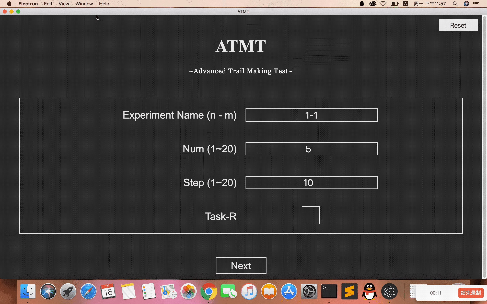

# ATMT

ATMT 課題サンプル (web programmingの勉強として作成しました、何が問題を発見した場合はIssuesで検討させて頂きます。)



## Setup

You should install npm annd electron beforehand.

<a herf=https://www.npmjs.com/get-npm>Install npm</a>

```
npm install -g electron
npm install
```

## Get Started
```
open terminnal
~$ cd (this project folder)
~$ npm start
```
```
open another terminnal
~$ cd (this project folder)
~$ electron .
```

## Usage

- 起動すると最初に設定画面が表示される．デフォルトから変更する場合は各種入力し`NEXT`を押す（この画面は被験者には見せないこと）
- 保存先:フォルダ: ./results/
- 結果ファイル: .csv形式で、`マークid，マークをクリックするまでの所要時間`が記録されている．
- 途中で実験を破棄してトップに戻りたい場合は`reset`ボタンを押すこと

## Build App

If you want to create a desktop app, you can use electron-packager
For example, if you create an app for OSX,

run

```
npm install -g electron-packager
npm install -g electron --unsafe-perm=true --allow-root
electron-packager . ATMT --platform=darwin --arch=x64 --icon=./icon
```

